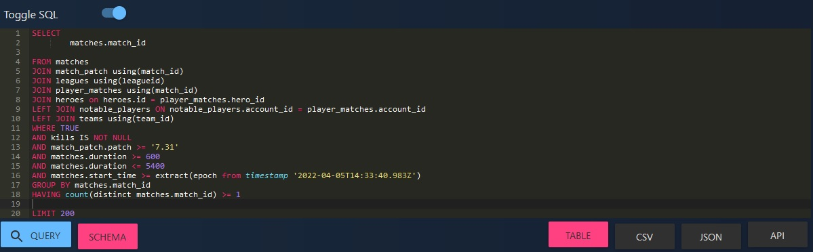

# How to use this artefact - Windows:

## Download and install the following:

- Git Bash
- Eclipse or another Java IDE
- PyCharm or another Python IDE

## Step 1: Get Match IDs
To download replays you'll need the match id for each game you want.
You can get match ids from [OpenDota](https://www.opendota.com/explorer).
In the explorer you can decide what patch you want replays from, min/max length of matches etc. Use 'Toggle SQL' to view and edit your query.

**This is an example the query could look like:** 

*From this query you'd get unique(distinct) match ids from 200 games that lasted 10-90 minutes on patch 7.31 or newer, oldest game is displayed first*

**When satisfied click the 'CSV'-button to save match ids in .csv format.**

## Step 2: Download Replays
Follow the instructions in main.py and run thread_pool(download, PATH_TO_MATCH_IDS, workers).

**NOTE: When downloading a large quantity of replays it requires quite a lot of disk space(1000 replays ~= 50gb)**

The replays will be downloaded as .dem-files compressed into .bz2-format.

## Step 3: Extract .dem
Follow the instructions in main.py and run thread_pool(extract, PATH_TO_BZ2, workers).

**NOTE: When extracting a large quantity of replays it requires quite a lot of disk space(1000 replays ~= 60gb)**

## Step 4: Parse data
Open script 'parse.java'.
This script is a modified version of OpenDota's parser, which in turn is based on skadistats' parser called clarity.
Run main.java.
Follow the instructions in main.py and run thread_pool(parse, PATH_TO_DEM, workers). 

In this script the .dem-files are translated into a readable .json-format. Information is presented as an arrangement of fields containing information for each time interval T.

It is possible to modify parse.java if you, for example, only need some of the data from the matches. 
"Entry" is what you are looking for, in parse.java, if you are looking to include or exclude any parameters from the .json file.

## Step 5: Preprocess data
**TODO: Optimize and expand this script**

Open the script 'preprocess.py' and follow the instructions.
Follow the instructions in main.py and run preprocess.run_single() or any other "run" method from preprocess.py that suits your needs.

**NOTE: This is most likely the most expensive and time consuming part of the process. Consider writing(and reading) to(and from) multiple disks using "run_per_thread()" for increased performance.**

This is where you are required to do some work to get the data needed for your model. You are able to use the information gathered through the parser to do calculations, normalize data etc.
Included in this script are som examples on calculating distances and how to include the results in the dataframe using lambdas.

Data is saved as a .csv-file for you to feed to your model.